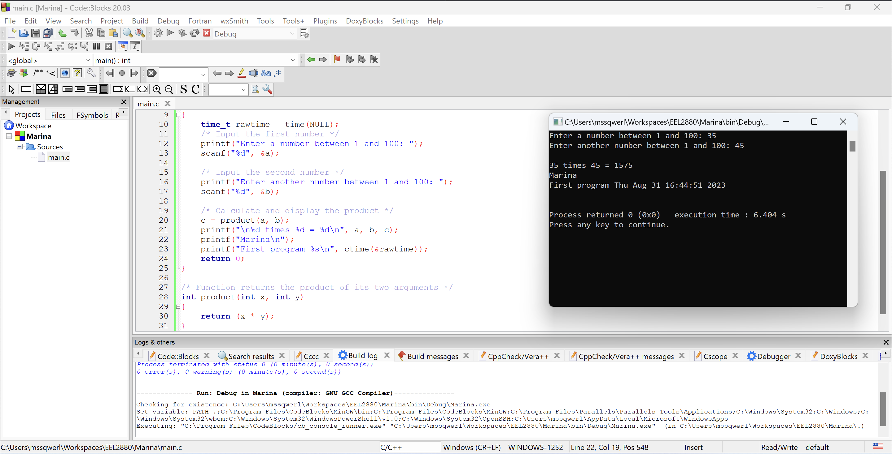

# Homework #2 - IDE
## August 31, 2023

1. **What folder holds the C compiler?**

    `C:\Program Files\CodeBlocks\MinGW\bin`
2. **What folder holds the header files?**

    `C:\Program Files\CodeBlocks\MinGW\include`
3. **What folder holds the library files?**

    `C:\Program Files\CodeBlocks\MinGW\lib`
4. **What folder holds Code::Blocks?**

    `C:\Program Files\CodeBlocks`
5. **What folder holds the executable version of your project?**

    `C:\Users\<my-user>\Workspaces\EEL2880\Marina\bin\Release`
