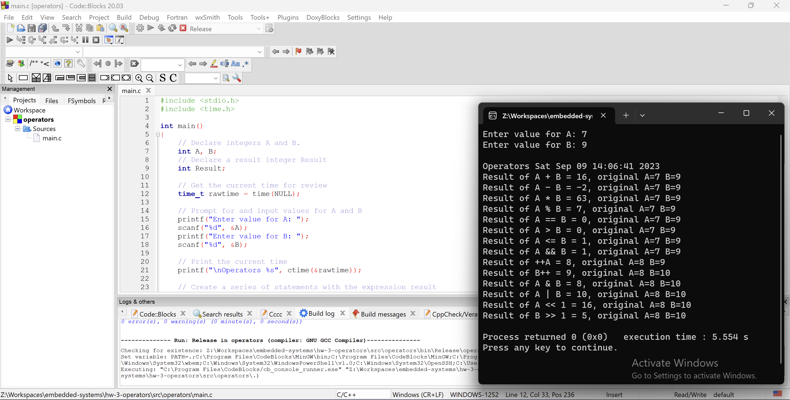

# Homework #3 - Operators
## September 7, 2023

1. **C language requires objects to be declared before they can be used. Which lines show objects being declared?**

    Lines 6-8.

2. **The object of line 7 is what type of container?**

    The object is a variable container.

3. **The object of line 7 is what data type for the contents?**

    The object has an integer data type.

4. **Which line instructs the compiler to include the stdlib header files as part of the source code?**

    Line 1.

5. **Which library contains the header declarations allowing printing onto the console?**

    `stdio`

6. **Which line is the starting point for the program called by the operating system?**

    Line 4.

7. **Which folder holds the system header files?**

    `C:\Program Files\CodeBlocks\MinGW\include`.

8. **Which line contains an assignment statement?**

    Line 19.

9. **Every C language program has a 'main' function. That function is described by what line numbers**

    Lines 4-24.
    
10. **Search Cplusplus.com and give the URL which explains and shows an example of scanf usage.**

    [https://cplusplus.com/reference/cstdio/scanf/?kw=scanf](https://cplusplus.com/reference/cstdio/scanf/?kw=scanf).
