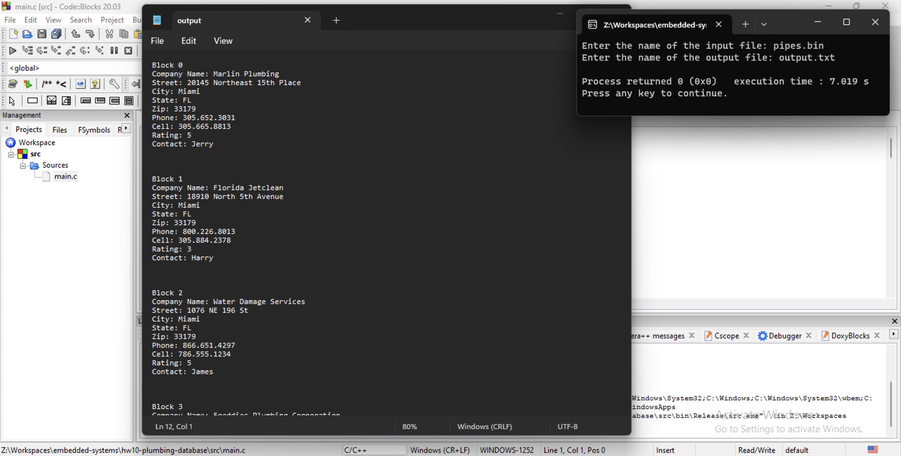

# Homework 10 - Plumbing Database
## November 17, 2023



------

```c
/**
 * This program reads the company names from the pipes.bin
 * plumbing database and prints them to a text file.
 */

#include <stdio.h>
#include <stdlib.h>
#include <string.h>

// Set string lengths
#define STRSHORT 15
#define STRMED 30
#define STRLONG 80

#define RECORDNUM 10

// Define the company's data structure
typedef struct company
{
    char name[STRLONG];
    char street[STRLONG];
    char city[STRMED];
    char state[STRMED];
    char zip[STRSHORT];
    char phone[STRSHORT];
    char cell[STRSHORT];
    int rating;
    char contact[STRLONG];
} company;

// Define the print function prototype
void printInfo(company *info, FILE *fp);

int main(void)
{
    // Files to read and write to
    // Input database
    FILE *database;             // pointer
    char databaseName[STRLONG]; // name
    // Output text file
    FILE *textFile;             // pointer
    char textFileName[STRLONG]; // name

    // Block number counter for the database
    int blockNum;

    // Declare an instance of the generic company data structure
    company *info = malloc(sizeof(company));

    // Prompt the user for the name of the database file
    printf("Enter the name of the input file: ");
    scanf("%s", databaseName);
    // Clear the keyboard buffer
    fflush(stdin);

    // Check if the database file exists
    // If the open fails, exit the program
    if ((database = fopen(databaseName, "rb")) == NULL)
    {
        fprintf(stderr, "Error opening input file %s\n", databaseName);
        exit(1);
    }

    // Prompt the user for the name of the output text file
    printf("Enter the name of the output file: ");
    scanf("%s", textFileName);
    // Clear the keyboard buffer
    fflush(stdin);

    // Check if the output text file exists
    // If the open fails, exit the program
    if ((textFile = fopen(textFileName, "w")) == NULL)
    {
        fprintf(stderr, "Error opening output file %s\n", textFileName);
        exit(1);
    }

    // For each block in the database file print the company data to the text file
    for (blockNum = 0; blockNum < RECORDNUM; blockNum++)
    {
        // Position the database file to the block corresponding to the block number
        // If the seek condition fails, exit the program
        if (fseek(database, blockNum * sizeof(company), SEEK_SET) != 0)
        {
            fprintf(stderr, "Error seeking to block %d\n", blockNum);
            exit(1);
        }

        // Read the company data block from the database file
        fread(info, sizeof(company), 1, database);

        // Add header text
        fprintf(textFile, "Block %d\n", blockNum);
        // Print the company data to the text file
        printInfo(info, textFile);
    }

    return 0;
}

/**
 * This function prints the company data to the text file.
 * @param info The company data structure.
 * @param fp The text file pointer.
 * @return void
 */
void printInfo(company *info, FILE *fp)
{
    fprintf(fp, "Company Name: %s", info->name);
    fprintf(fp, "Street: %s", info->street);
    fprintf(fp, "City: %s", info->city);
    fprintf(fp, "State: %s", info->state);
    fprintf(fp, "Zip: %s", info->zip);
    fprintf(fp, "Phone: %s", info->phone);
    fprintf(fp, "Cell: %s", info->cell);
    fprintf(fp, "Rating: %d\n", info->rating);
    fprintf(fp, "Contact: %s", info->contact);
    fprintf(fp, "\n\n\n");

    return;
}
```