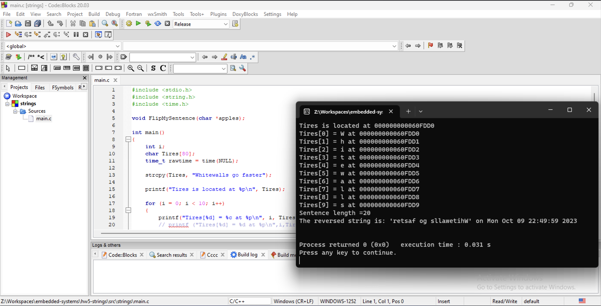

# Homework #5 - Binary Print
## October 10, 2023



```c
#include <stdio.h>
#include <string.h>
#include <time.h>

// Define the FlipMySentent function prototype
// The function will be defined later in the file
void FlipMySentence(char *apples);

/**
 * @brief This is the main function for the program.
 * @return int - Returns 0 if successful
 */
int main()
{
    // Define the counter for the upcoming loop
    int i;
    // Define the string/array we will use to store our sentence.
    // This will reserve memory for 80 characters (79 + null terminator/binary zero)
    char Tires[80];
    // Define and initialize a variable to hold the current time
    time_t rawtime = time(NULL);

    // Copy the string into the `Tires` string
    strcpy(Tires, "Whitewalls go faster");

    // Print the address of the string `Tires`
    // %p is the format specifier for a pointer
    printf("Tires is located at %p\n", Tires);

    // Loop through the first 10 characters of the string
    for (i = 0; i < 10; i++)
    {
        // Print the character at the current index and its location
        printf("Tires[%d] = %c at %p\n", i, Tires[i], &Tires[i]);
        // printf ("Tires[%d] = %d at %p\n",i,Tires[i], &Tires[i]);
        // printf ("Tires[%d] = %c at %p\n",i,*(Tires+i), Tires+i);
    }

    // Call the FlipMySentence function and pass it the pointer to the
    // `Tires` string
    FlipMySentence(Tires);

    // Print the reversed string and the current time
    printf("The reversed string is: '%s' on %s\n", Tires, ctime(&rawtime));

    // Return 0 to tell the OS the program exited without errors
    return 0;
}

/**
 * @brief This function will reverse the string passed to it.
 * @param apples The pointer to the string to reverse
 * @return void
 */
void FlipMySentence(char *apples)
{
    // Define and initialize the variables we will use in the loop
    // The scope of these variables are limited to this function only
    int i, j, length = 0;
    // Define a temporary variable to hold the character we are swapping
    // The scope of this variable is limited to this function only
    char temp;

    // Get the length of the string
    length = strlen(apples);
    // Print the length of the string
    printf("Sentence length =%d\n", length);

    // Loop through half of the string, swapping the characters
    // i is the first element of the array
    // j is the last element of the array, and is set to length - 1
    // to avoid the null terminator
    // As the loop progresses, i is incremented and j is decremented
    // and the loop will only have to go halfway through the string
    // to swap all characters.
    for (i = 0, j = length - 1; i < j; i++, j--)
    {
        // Store the character at the current index in a temporary variable
        temp = apples[i];
        // Set the character at the current index to the character at the
        // opposite index
        apples[i] = apples[j];
        // Set the character at the opposite index to the character in the
        // temporary variable
        apples[j] = temp;
    }

    // Since the function modifies the string directly, there is no need to
    // return anything.
    return;
}
```

1. **`Tires` is what type of container?**
   
   `Tires` is an array.

2. **How many Bytes in `Tires`?**
   
   `Tires` is 80 bytes.

3. **What index is the frst element of `Tires`?**
   
   The index of the first element of `Tires` is 0.

4. **What index is the last element of `Tires`?**
   
   The index of the last element of `Tires` is 79.

5. **Is `Tires` contiguous?**
   
   Yes. `Tires` is contiguous.

6. **What does `strcpy` do?**

   `strcpy` copies the string starting at the pointer passed as the second argument into the destination pointer passed as the first argument.

7. **What data types are the calling arguments of strcpy (pointer, value)?**

   The arguments of `strcpy` are both pointers.
   
8. **How can `main()` have `Tires` array and `FlipMySentence` have `apples`?**

   In `main`, the pointer for the `Tires` array is passed as an argument to `FlipMySentence`, which then assigns it to `apples` within the scope of the function. Because a pointer is passed to `FlipMySentence` instead of the value of `Tires`, both names point to the same array.
   
9. **What value is passed as calling parameter for `FlipMySentence`?**

    A value is not passd to `FlipMySentence`, but rather the pointer for the `Tires` array which translates to the location of the first element of that array.

10. **What is the scope of `apples`?**

    The scope of `apples` is within `FlipMySentence` function, from line 32 to 47.

11. **What data type is the parameter for calling `strlen`?**
    
    The parameter is the pointer to the string being measured.

12. **The following code from the function do what?**
    ```c
    temp = apples[i];
    apples[i] = apples[j];
    apples[j] = temp;
    ```

    The code above assigns the value of the element at `apples[i]` to `temp`, then assigns the value of the element at `apples[j]` to `apples[i]`. Finally, it takes the original value of `apples[i]` that was stored in the `temp` variable and assigns it to `apples[j]`

13. **Line 43 what value is being modifed with the assignment statement?**
    ```c
    apples[i] = apples[j];
    ```

    The current value of the element in `apples[i]` is being replaced with the value of the element in `apples[j]`.

14. **What is the scope of `temp`?**
    
    The scope of `temp` is within `FlipMySentence` function, from line 32 to 47.

15. **Why is `j` initialized to `length-1`?**
    
    Because the last element in a string array is a null terminator (or binary zero).
