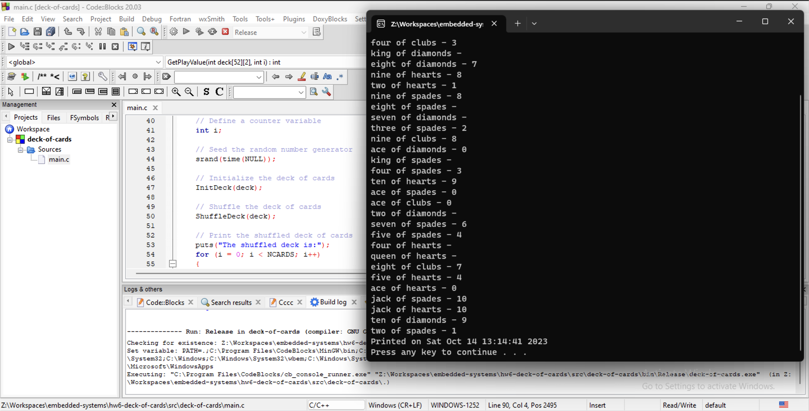

# Homework 6 - Deck of Cards
## October 14, 2023



```c
#include <stdio.h>
#include <stdlib.h>
#include <time.h>

// Total number of cards in a deck
#define NCARDS 52
// Number of properties for each card
#define NPROPS 2

// Number of suits in a deck
#define NSUITS 4
// Number of face values per suit
#define NFACES 13

// Define the suits as arrays of strings
char *suit[NSUITS] = {"hearts", "spades", "clubs", "diamonds"};

// Define the face values as arrays of strings
char *face[NFACES] = {"ace", "two", "three", "four", "five", "six", "seven", "eight", "nine",
                      "ten", "jack", "queen", "king"};

// Define function prototypes that will be defined later
// and used to manipulate the deck of cards
int GetPlayValue(int deck[NCARDS][NPROPS], int i);
void InitDeck(int deck[NCARDS][NPROPS]);
void PrintCard(int deck[NCARDS][NPROPS], int i);
void ShuffleDeck(int deck[NCARDS][NPROPS]);
void SwapCards(int deck[NCARDS][NPROPS], int src, int dest);

int main()
{
    // Define the deck of cards as a 2D array of integers
    // Each card is represented by an array of 2 integers:
    // 1st integer is the suit of the card
    // 2nd integer is the face value of the card
    int deck[NCARDS][NPROPS];
    // Get the current time for the homework submission
    time_t rawtime = time(NULL);

    // Define a counter variable
    int i;

    // Seed the random number generator
    srand(time(NULL));

    // Initialize the deck of cards
    InitDeck(deck);

    // Shuffle the deck of cards
    ShuffleDeck(deck);

    // Print the shuffled deck of cards
    puts("The shuffled deck is:");
    for (i = 0; i < NCARDS; i++)
    {
        PrintCard(deck, i);
    }

    printf("Printed on %s", ctime(&rawtime));
    system("PAUSE");

    return 0;
}

/**
 * Get the play value of a card in the deck
 * @param deck The deck of cards
 * @param i The index of the card
 * @return The play value of the card
 */
int GetPlayValue(int deck[NCARDS][NPROPS], int i)
{
    // Create local variables: facevalue, playvalue
    int facevalue, playvalue;

    // Assign facevalue from card at index i in deck
    facevalue = deck[i][1];

    // Assign the pay value of the card
    // When the face value is less than or equal to 10,
    // the play value is the face value.
    if (facevalue <= 10)
    {
        playvalue = facevalue;
    }
    // For face values jack, queen and king, the play value is 10.
    else
    {
        playvalue = 10;
    }

    return playvalue;
}

/**
 * Initialize the deck of cards by setting the suit and face value
 * in the 2D array of integers
 * @param deck The deck of cards
 * @return void
 */
void InitDeck(int deck[NCARDS][NPROPS])
{
    // Define a counter variable
    int i, j;

    // Loop through suits
    for (i = 0; i < NSUITS; i++)
    {
        // Loop through faces
        for (j = 0; j < NFACES; j++)
        {
            // Calculate the index of the card
            int idx = i * NFACES + j;
            // Set the suit value
            deck[idx][0] = i;
            // Set the face value
            deck[idx][1] = j;
        }
    }
}

/**
 * Print the face value, suit and play value of the card
 * @param deck The deck of cards
 * @param i The index of the card
 * @return void
 */
void PrintCard(int deck[NCARDS][NPROPS], int i)
{
    // Create local variables: suitvalue, facevalue, playval
    int suitvalue, facevalue, playvalue;
    // Assign suitvalue & facevalue from card at index i in deck
    suitvalue = deck[i][0];
    facevalue = deck[i][1];

    // Get the play value of the card
    playvalue = GetPlayValue(deck, i);

    // Print the string value of the card
    printf("%s of %s - %d \n", face[facevalue], suit[suitvalue], playvalue);
}

/**
 * Loop through each card of the deck and swap it with a random card
 * @param deck The deck of cards
 * @return void
 */
void ShuffleDeck(int deck[NCARDS][NPROPS])
{
    // Create local variables (src, dest)
    int src, dest;
    // Loop through each card in the deck and set
    // the destination index
    for (dest = 0; dest < NCARDS; dest++)
    {
        // Get a random index for the source card
        src = rand() % NCARDS;
        // Swap the cards
        SwapCards(deck, src, dest);
    }
}

/**
 * Swap the properties of two cards
 * @param deck The deck of cards
 * @param src The source card
 * @param dest The destination card
 * @return void
 */
void SwapCards(int deck[NCARDS][NPROPS], int src, int dest)
{
    // Define a temporary local variable
    int temp;
    // Define a counter variable
    int i;

    // Loop through the properties of the card
    // and swap them
    for (i = 0; i < NPROPS; i++)
    {
        // Copy the destination card's property to the temporary variable
        temp = deck[dest][i];
        // Copy the source card's property to the destination card's property
        deck[dest][i] = deck[src][i];
        // Copy the temporary variable to the source card's property
        deck[src][i] = temp;
    }
}
```