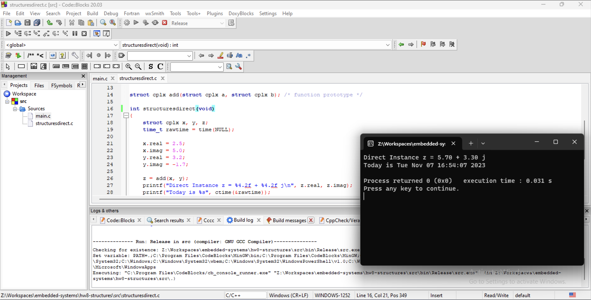
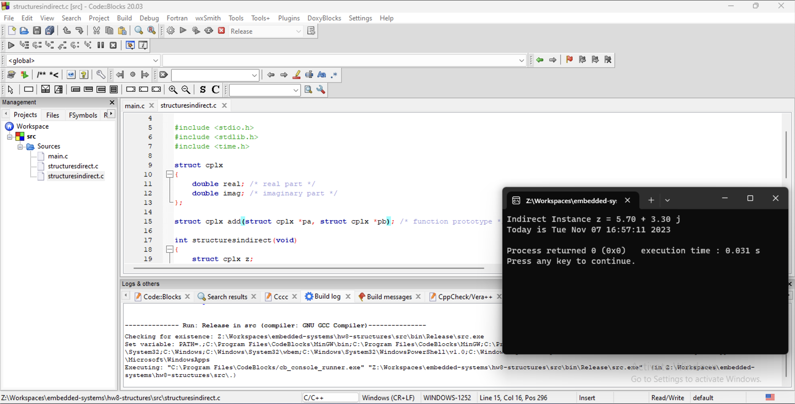

# Homework 8 - Structures
## November 7, 2023

### Structures - Direct

1. **Run the program from Illustration 1 and submit a copy of the console output.**

2. **Which lines form the prototype for a structure**
Lines 8 - 11

3. **What is the tag name of the structure**
`cplx`

4. **Which lines create instances of the structure, what are the structure names?**
Line 18 creates `x, y, z`

5. **Which lines initialize the member elements of the structures? How?**
Lines 22 - 25 initialize each member of `x` and `y` by derefencing and assigning `double`s to them.

Line 28 defines the members of `z` by calling the `add` function, which assigns the first argument to a variable, and then derefences each member of the stored structure, and adds it to the corresponding member in the second argument.

6. **Which line is the prototype for a function with structure parameters**
Line 13

7. **Which lines are the function definition with structure parameters**
Lines 35 - 42

8. **How are the member elements of a named (direct instance) structure dereferenced (how are the values changed)?**
The members are dereferenced using `.`

9. **How is the addition of two structures accomplished?**
The function receives a copy of each of the arguments, and assigns a copy the first argument to variable as a temporary placeholder. It then deferences each member of the structure, and adds the corresponding member of the second argument. 

### Structures - Indirect

10. **Run the program from Illustration 2 and submit a copy of the console output.**

11. **Which lines create instances of the structure, what are the structure names?**
Lines 19, `z`

12. **What are the structure pointer names?**
`px` and `py`

13. **Which lines initialize the member elements of the structures? How?**
Lines 26 - 29 initialize each member of `px` and `py` by derefencing and assigning `double`s to them.

Line 28 defines the members of `z` by calling the `add` function, which assigns the value of the first pointer argument to a variable, and then derefences each member of the stored structure, and adds it to the corresponding member in the second argument by dereferencing the value of its member.

14. **Which line is the prototype for a function with structure pointer parameters**
Line 15

15. **Which lines are the function definition with structure pointer parameters**
Lines 40 - 47

16. **How are the member elements of an unamed (indirect instance) structure dereferenced (how are the values changed)?**
The members are derefenced using `->`

17. **How is the addition of two structures accomplished?**
The function receives a pointer to each of the arguments, and assigns the contents of the first argument to variable as a temporary placeholder. It then deferences each member of the structure, and dereferences the corresponding member of the second argument, and adds its value. It then returns the contents of the temporary structure placeholder.

18. **Could a pointer be returned from the function?**
Not as it is defined, but it could be changed to return a pointer to `c`
